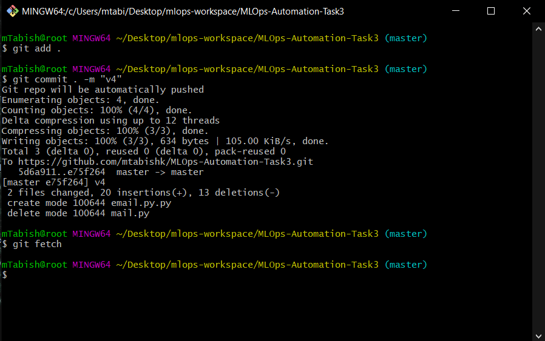
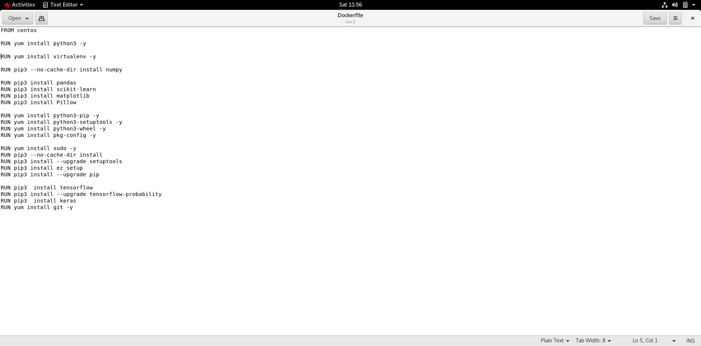
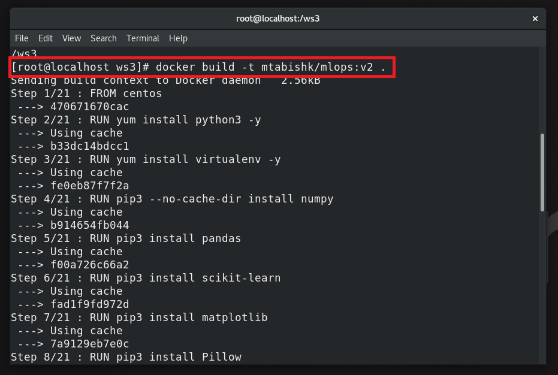
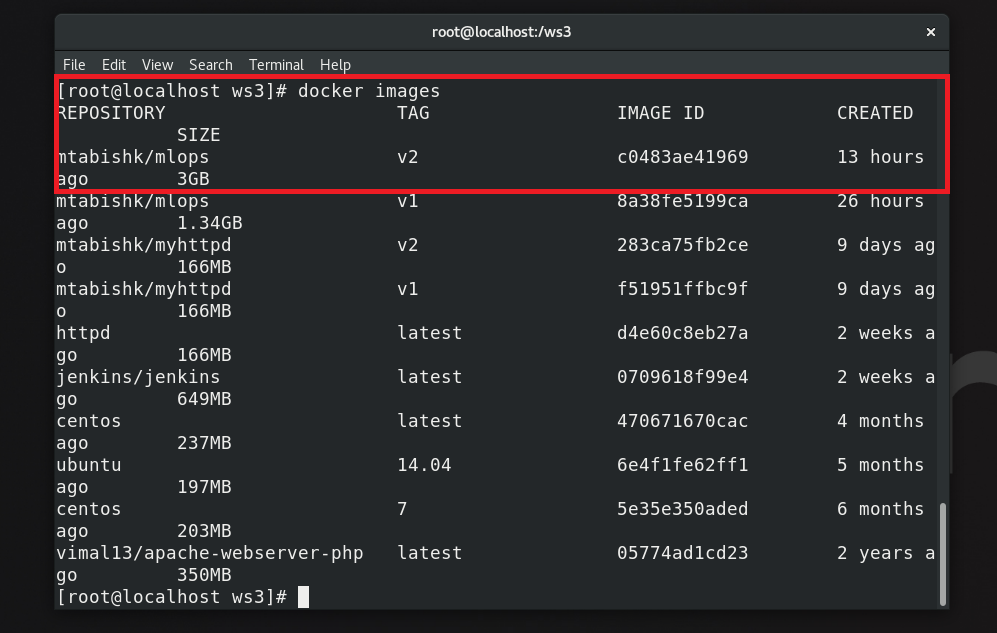
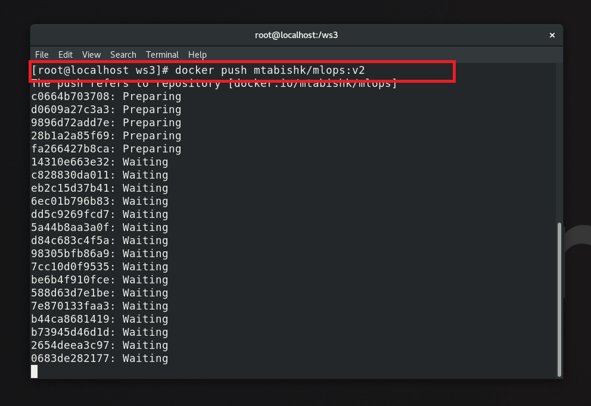
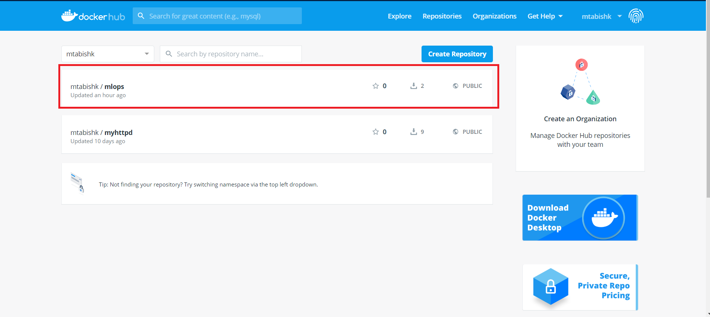
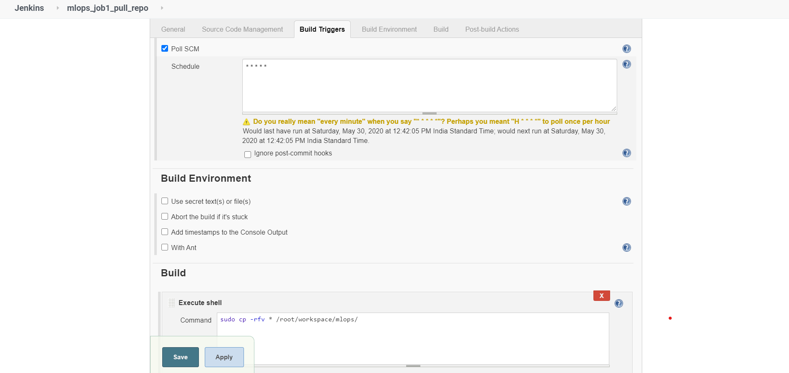
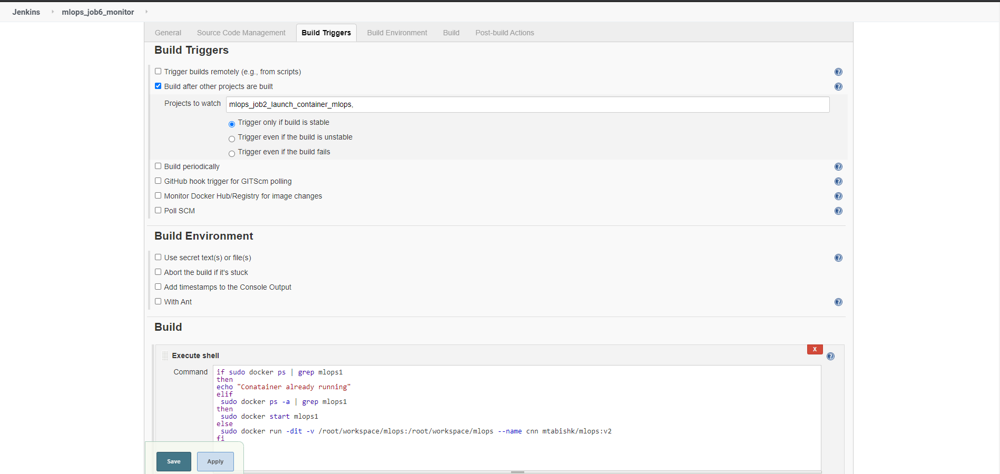

# MLOps-Automation-Task3
## Project: Automation in training of Machine Learning Model using DevOps Tools.


## Description:
#### 1. Create container image that’s has Python3 and Keras or numpy  installed  using dockerfile 
#### 2. When we launch this image, it should automatically starts train the model in the container.
#### 3. Create a job chain of job1, job2, job3, job4 and job5 using build pipeline plugin in Jenkins 
#### 4.  Job1 : Pull  the Github repo automatically when some developers push repo to Github.
#### 5.  Job2 : By looking at the code or program file, Jenkins should automatically start the respective machine learning software installed interpreter install image container to deploy code  and start training( eg. If code uses CNN, then Jenkins should start the container that has already installed all the softwares required for the cnn processing).
#### 6. Job3 : Train your model and predict accuracy or metrics.
#### 7. Job4 : if metrics accuracy is less than 80%  , then tweak the machine learning model architecture.
#### 8. Job5: Retrain the model or notify that the best model is being created
#### 9. Create One extra job job6 for monitor : If container where app is running. fails due to any reason then this job should automatically start the container again from where the last trained model left

```
Dataset used to train this Model: 
Fashion MNIST dataset. It consists of a training set of 60,000 
examples and a test set of 10,000 examples. Each one is a 28x28 grayscale image, 
associated with a label from 10 classes
```
***Assumptions:
RedHat Linux 8 or Centos 8 running in a Virtual box. Docker is installed and configured. Java and Jenkins with plugins like Build Pipeline, GitHub  should be installed and configured too  ***

## STEP 1: Git and GitHub
1. Create a repository on GitHub then clone that repository on your local machine using Git. Commit your code and push it to GitHub.



## STEP 2: Dockerfile and DockerHub
1. Create a Dockerfile for creating a container image having CentOS and all other dependencies installed for training our ML Model.

2. Build the Dockerfile using the name tag of your docker hub account so that we can upload our container image to docker hub.


3. Push the container image to Docker Hub



## STEP 2: Setup Jenkins Jobs
#### Job1: For fetching repo from GitHub
This job will copy repository from github whenever developer pushes the code to Github. This job has a build trigger Poll SCM enabled in it that will check every minute if there is any update in github.


#### Job2: For launching container
This job is interesting it will check the code/program file then automatically launch container having the respective language interpreter installed in it. This job is also chainnned with Job1. It will run only when Job1 is successfully build.


#### Job3: For Testing
This job tests our web application. If its running then the job will build successfully otherwise it will fail and it will send email to developer that the job is failed.


#### Job4: For monitoring container
This Job will automatically launch the container if for some reason container is down


### Dashboard

