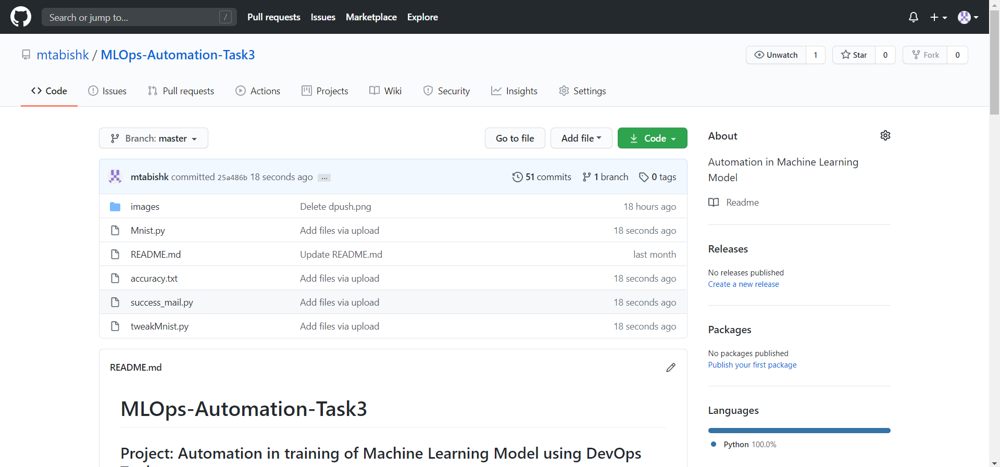

# MLOps-Task3
## Project: Automation in training of Machine Learning Model using DevOps Tools.


## Description:
#### 1. Create container image that’s has Python3 and Keras or numpy  installed  using dockerfile 
#### 2. When we launch this image, it should automatically starts train the model in the container.
#### 3. Create a job chain of job1, job2, job3, job4 and job5 using build pipeline plugin in Jenkins 
#### 4.  Job1 : Pull  the Github repo automatically when some developers push repo to Github.
#### 5.  Job2 : By looking at the code or program file, Jenkins should automatically start the respective machine learning software installed interpreter install image container to deploy code  and start training( eg. If code uses CNN, then Jenkins should start the container that has already installed all the softwares required for the cnn processing).
#### 6. Job3 : Train your model and predict accuracy or metrics.
#### 7. Job4 : if metrics accuracy is less than 80%  , then tweak the machine learning model architecture.
#### 8. Job5: Retrain the model or notify that the best model is being created
#### 9. Create One extra job job6 for monitor : If container where app is running. fails due to any reason then this job should automatically start the container again from where the last trained model left


### Dataset used to train this Model: 
###### MNIST (Modified National Institute of Standards and Technology) dataset. The MNIST dataset is a large database of handwritten digits that is commonly used for training various image processing systems. The database is also widely used for training and testing in the field of machine learning. It consists of a training set of 60,000 examples and a test set of 10,000 examples. Each one is a 28x28 grayscale image, associated with a label from 10 classes

***Assumptions:
RedHat Linux 8 or Centos 8 running in a Virtual box. Docker is installed and configured. Java and Jenkins with plugins like Build Pipeline, GitHub  should be installed and configured too  ***

## STEP 1: GitHub
1. Create a repository on GitHub and upload all the the files required to complete the task there. 


## STEP 2: Dockerfile and DockerHub
1. Create two Dockerfiles for creating  two container images, first one having complete environment that uses sklearn library and the other one having complete environment that uses keras library for training our Machine Learning model.
#### Dockerfile for sklearn library and all the dependencies

Build the Dockerfile using the name tag of your docker hub account so that we can upload our container image to docker hub.
##### Run these commands: 
``` docker build -t mtabishk/sklearnenv . ```

``` docker login ```

``` docker push mtabishk/sklearnenv```

#### Dockerfile for keras library and all the dependencies

Build the Dockerfile using the name tag of your docker hub account so that we can upload our container image to docker hub.
##### Run these commands: 
``` docker build -t mtabishk/kerasnenv . ```

``` docker login ```

``` docker push mtabishk/kerasenv```

#### Docker Hub 


#### Docker images


## STEP 3: Setup Jenkins Jobs
#### Job1: For fetching repo from GitHub
This job will copy repository from github whenever developer pushes the code to Github. This job has a build trigger Poll SCM enabled in it that will check every minute if there is any update in github.


#### Job2: Jenkins should automatically start the respective machine learning software installed interpreter install image container to deploy code  and start training


#### Job3: Train your model and predict accuracy or metrics.


##### Console Output of Job3


#### Job4: if metrics accuracy is less than 80% , then tweak the machine learning model architecture.


##### Console Output of Job3


#### Job5:  Retrain the model or notify that the best model is being created


##### Console Output of Job3


#### Job6: If container where app is running. fails due to any reason then this job should automatically start the container again from where the last trained model left


## Complete Build Pipeline


